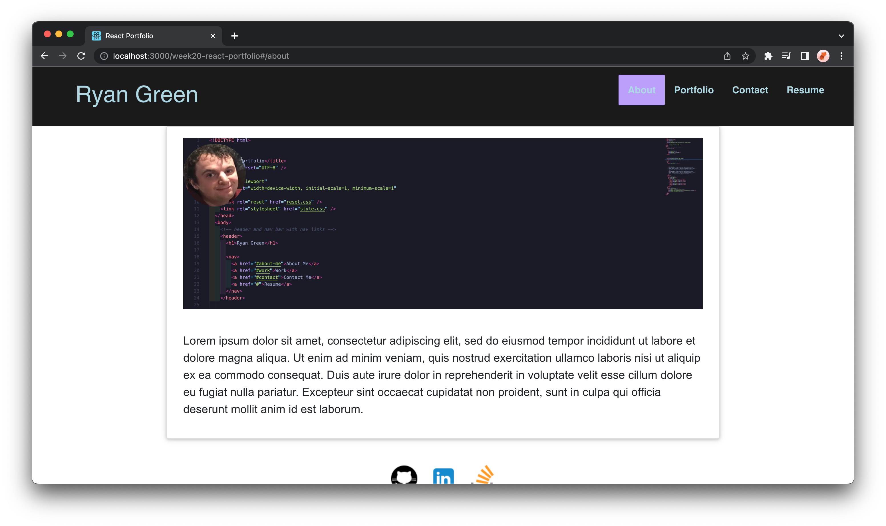

# React-Portfolio

## Description

A single paged portfolio made using react. Sepearte sections for about, portfolio, contact, and resume. Used newly learned react skills to make a fast loading react app.

## Installation

Deployed to Github pages
https://nuglah.github.io/week20-react-portfolio/#/about

## Usage

Clicking the nav links renders the different content to the content section. You can view previous projects in the portfolio section with links to the github page. The contact section lets you sen an email. The footer has links to my github, linkedin, and stack overflow profiles

